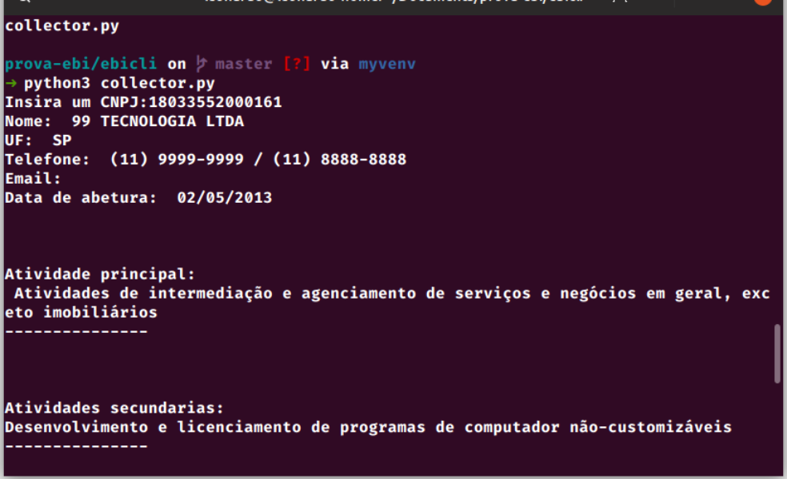
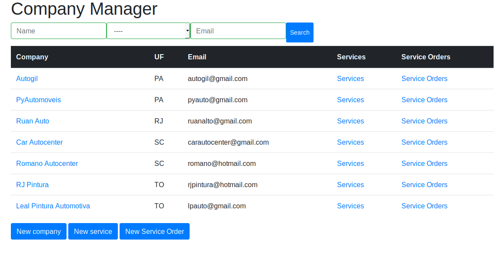

# Prova EBI

### Aplicações desenvolvidas como parte da seleção de estagiário para a EBI Informática.

Abaixo contém as três partes da prova com suas respectivas aplicações e instruções de uso:

#### Parte 1

Use a biblioteca requests para consumir api da receitaws com o método GET

Clone ou faça download deste repositório.

Mova-se até o diretório  basta executar `python3 collector.py` e um CNPJ será requisitado:

#### Parte 2

A resolução desta parte está no seguinte repositorio: 

#### Parte 3

Clone ou faça download deste repositório.

Na pasta do repositório execute:
- `pip3 install -r requirements.txt` Para instalar as dependências do projeto.
- `python3 manage.py runserver` para executar a aplicação.

